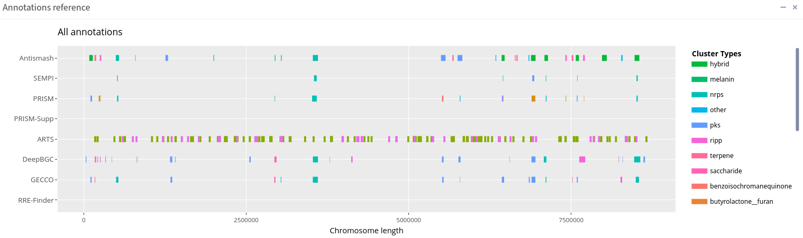

# BGCViz <small>1.0</small>

> A integrative BGC interception visualisation tool

- Easy to use with an intuitive UI 
- Beautiful inteception plots 
- Powerful DeepBGC data comparison

[GitHub](https://github.com/ostash-group/BGCViz)
[Get Started](#BGCViz)

