```{r, include = FALSE}
knitr::opts_chunk$set(
  collapse = TRUE,
  comment = "#>"
)
```

# Quick start guide

  

**Note:** The guide is divided into "steps", but no "pipeline" or sequential steps exist. Rather after files upload (Step 1 and 2) you are free to use the analysis according to your needs. This guide is used mostly for a quick introduction to the BGCViz capabilities  

**BGCViz is intended to be run on one sequence. Therefore, it is not possible to analyze genomes with several contigs. One contig at a time only**

  

# Step 1. Getting the input files

A detailed description of every possible input file is [here](https://ostash-group.github.io/BGCViz/#/Input_files_options). In short, prior to use, antismash, prism, sempi and ARTS results should be downloaded. And if, downloaded correct formats, they can be used right away.

  
# Step 2. Uploading input files

The upload of the files is pretty straightforward - use the properly named file upload section. Prior to upload, no UI toggles and elements are shown.

### Note: You can use example data from S.coelicolor, pressing the button on "Use Example data" box

After the upload of the first input:


  
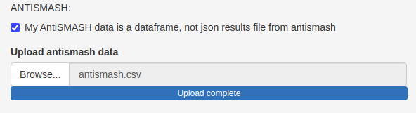


  
**Please also enter the length of the contig in the corresponding field under uploads. This length is used for correct representation of Biocircos plot**

## Results with only one file upload

1. The first two plots are available for the analysis on the "Annotation visualization and comparison" sidemenu. The first plot contains all the results for the antimash annotation. With more file uploaded, results for whole annotations will appear here, with respect to the chromosome position.

  

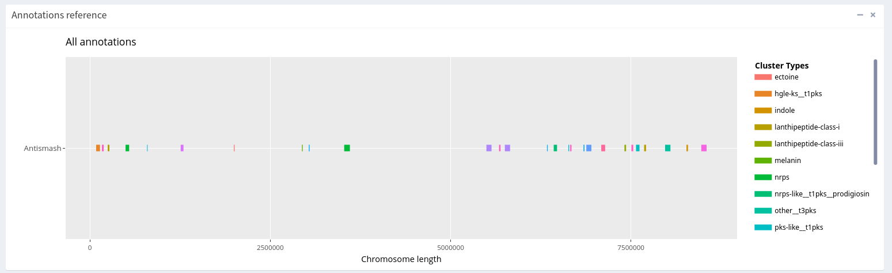

  

2. The second plot shows the BGC, intercepted with the chosen one. As a rule, on the top, there is an output which is used as a reference. In our case, this output is antismash. After uploading more files, they will be visualized under antismash one. And only clusters, which are intercepted with the chosen one, are visualized. (On the upper plot all the data is visualized).

  


  

For now, this plot is the same as a plot above, due to lack of data.

  

### Controls

"Visualize AntiSMASH BGC with several types as 'Hybrid'" check box is available under "Global options" sidemenu option. This will rename the multiple typer regions as "hybrid".

  

**Tip: We suggest using this option after renaming the clusters (step 3 here). Because several product cluster can become monotype after renaming. Therefore more information about type will be preserved.**

  

## Results with multiple files upload

Let's proceed and upload PRISM and SEMPI results

### The example S.coelicolor data is available upon button press under PRISM and SEMPI input fields.

The plots in previous sidemenu changed. Also, two additional sidemenus appeared:

1. Biocircos plot sidemenu contains dynamic circos plot for all-vs-all interception results. More details in [step 4](#step-4-color-the-links-in-biocircos-plot)

2. Summarize interception sidemenu contains data, that can help to prioritize clusters, based on how many times it is annotated by another tool. More details in [step 5](#step-5-change-the-data-to-group-by)  

Because we uploaded the json PRISM file (from PRISM 4.4.5), which also contains resistance and regulatory genes which can be mapped to the genomic coordinates, a new "chromosome" is visualized with these genes, named "P-supp". More details available [here](https://ostash-group.github.io/BGCViz/#/Input_files_options#PRISM). The genes are invisible on the plots due to plot scale. To make them more visible, you can tick the "Add thickness to PRISM resistance + regulatory genes results visualization" checkbox in Global options.

  


  

They are more controls for data manipulation available, as well as more plots. They all will be discussed in the following steps.

  

# Step 3. Rename the input clusters

## Step 3.1 Rename the clusters

It is a good practice, to rename the type of clusters after uploading. Renaming the clusters will hugely affect the coloring schema. In other ways, it will decrease the clutter in the legend and improve high-level visual comparison. Also, renaming is somewhat essential for coloring the Biocircos links and arcs.


To rename the dataset you can press "Rename" button under "Improve visualization" menu.


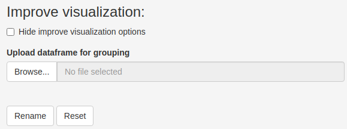

  

The legend on the plots changes, but the "Type" field upon mouse cursor hovering on the cluster remains unchanged. Therefore, the initial products are available on mouse hover. Alternatively, the "Reset" button reverts the clusters types to the initial ones.

  

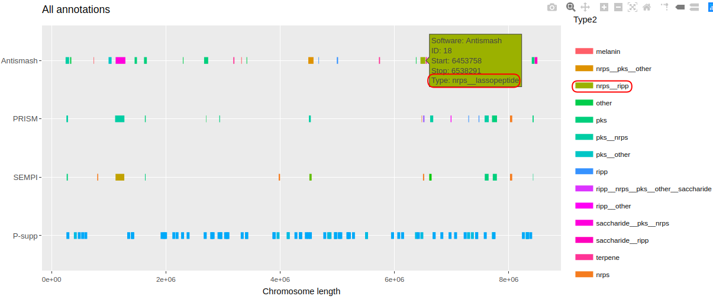

  
So , the color indicates, that the product is ripp (on a legend), but Type field on hover indicates the true tyep (lanthipeptide-class-i)

The renaming scheme is available in the [Glossary](https://ostash-group.github.io/BGCViz/#/Glossary). Guide how to change it available [here](https://ostash-group.github.io/BGCViz/#/BGCViz_renaming_and_coloring_options).

  

## Step 3.2 If multi-type - make hybrid

By default, all hybrids remain intact after renaming. However, it is possible to include renaming rule for a particular hybrid (nrps__pks -> nrps). The last step in renaming is to tick the ".....rename as hybrid" checkboxes:

  

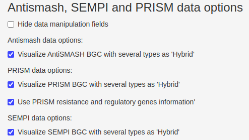

  


# Step 4. Color the links in biocircos plot

The other tab is "Biocircos plot". By default, no coloring is done (the data should be renamed, or, at least, match coloring scheme (more about changing colors in [here](BGCViz_renaming_and_coloring_options.md)) and about link coloring modes is [here](https://ostash-group.github.io/BGCViz/#/Logic_of_the_output#biocircos-plot))

  

The first plot is a default circos plot with an all-vs-all interception. More information is available on hover. The visualized type information (in the links and arcs) is a default product naming, not the renamed version.

  


  

The second plot is actually a legend for circos plot:

  


  

**Note: "base" color indicates the default color. Please include it, if changing the coloring scheme (more [here](BGCViz_renaming_and_coloring_options.md))**

  

The coloring options for biocircos plot are available under "More" button at the top of the plot:

  

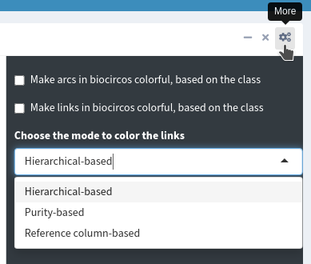

  

There are three coloring modes available for the links, which are discussed in much more details in the appropriate [section](https://ostash-group.github.io/BGCViz/#/Logic_of_the_output#biocircos-plot). The problem with links is that they can connect clusters with separate types. Mentioned modes are just different ways to deal with this issue.

  

# Step 5. Change the data to group by

  

The last sidemenu called "Summarize interception". It contains count barplot, which shows how many times the chosen cluster was annotated by any other tool, and "Group by" table, which shows which clusters are intercepted with the reference (first column).

For our example, the barplot looks like this:

  

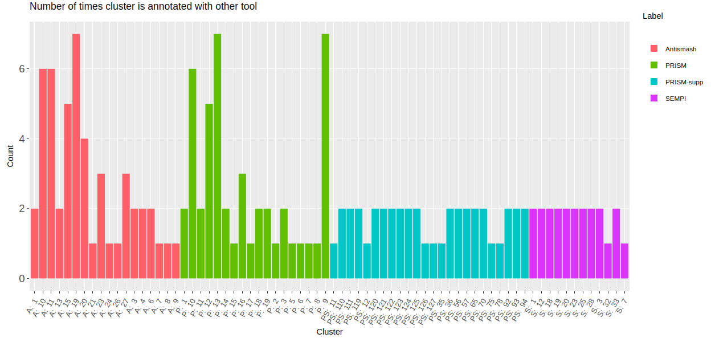

  

From the chart we can see that cluster #10 from antismash and #9 from prism have pretty good amout of data supporting their annotation (let's take arbitrary clusters with high count). The group by table reveals, the intercepted clusters:

  

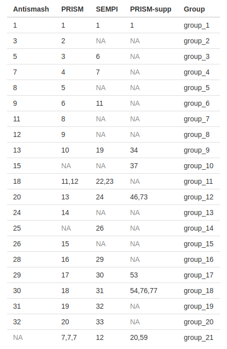

  

We can conclude that cluster #10 from antismash, #9 from PRISM, #12 from SEMPI are the same one. Moreover, it contains 1 resistance genes (#54) and 3 regulatory genes (#51-53), as identified by PRISM. Types of clusters can be viewed with a pop-up with hover with a mouse:

 

The interception of all named clusters can be confirmed in the Biocircos plot, or by reviewing PRISM and SEMPI data as a group_by columns:

  

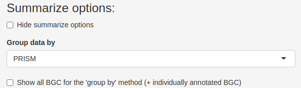

  

By default, only intercepted regions are showed. But if the purpose of the analysis is to show novel regions, annotated by just one program, then tick the "Show all BGC for the 'group by' method (+ individually annotated BGC)" checkbox. For example, if we group our data by Antismash and check the box it becomes clear, that many clusters are annotated only by this algorithm.

  

**Tip: Check the last ("NA") row in the first column. It shows the clusters, that are not intercepted with the reference data but are intercepted among other methods. For example, cluster #6 from PRISM is in NA row, when we group by Antismash. When we group by PRISM, it becomes clear that this cluster is annotated only by SEMPI (#7). The similar situation is with PRISM regulatory (#4) gene, which is not intercepted by Antismash. If we group the data by the PRISM column, it will land in corresponding group**

  

**Tip #2: You can view the group by column in "Annotation visualization and comparison" tab for feature-rich visualization on hover. Just choose the same column in the select menu for that plot**

# Step 6. Compare to the DeepBGC

The clusters in the previous annotations are can be thought to be "boolean". Therefore, they are either annotated (so exists in the data), or not. The DeepBGC data contains several scores alongside cluster information. This program uses the deep learning model, which can annotate different from rule-based methods, novel clusters. The scores are deepbgc score, activity score and cluster type score. More about the model and the scores are available in the paper (DOI: [10.1093/nar/gkz654](https://doi.org/10.1093/nar/gkz654) ).

The output tsv file is the standard input for BGCViz. After uploading several plots are available in the new "Compare the DeepBGC data" tab.

1.The DeepBGC comparison to the reference annotation. Therefore, the barplot shows how many clusters annotated at every chosen score threshold only by DeepBGC, only by chosen reference data (here Antismash) and by both. In the upper right corner applied score threshold are visualized for DeepBGC data (the default are 50%). This plot can help to choose the annotated/novelty rates for DeepBGC.

  

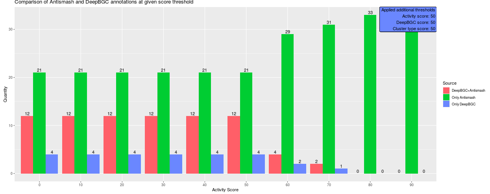

  

2. Connected scatter plot with Novelty, Annotation and Skip rates, where:

- Novelty rate = "# of BGC annotated only by deepbgc"/("# clusters annotated with only by antismash" + "# clusters annotated with antismash and deepbgc"). This rate points to how many clusters are annotated only by DeepBGC.

- Annotation rate = "# of BGC annotated by antismash and deepbgc"/"total number of antismash annotated BGC". This rate points to how much DeepBGC annotated clusters alongside with antismash.

- Skip rate = "# of BGC annotated only by antismash"/"total number of antismash clusters". This rate points of how many clusters DeepBGC missed, assuming, that antismash is a reference annotation

These rates are just the other way to visualize the bar plot


The controls for the comparison plots looks like this:

  

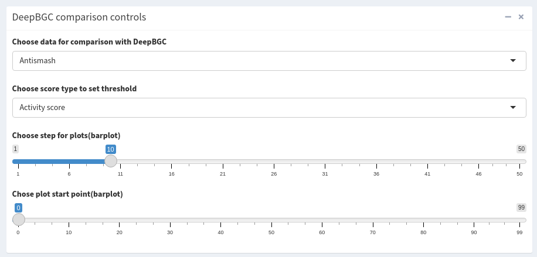

  

Note, that you can choose which data to compare the DeepBGC among PRISM, Antismash and SEMPI, as well as score and plot step.

The data cleaning options for DeepBGC are basically the columns of .tsv output file and are the following:

  

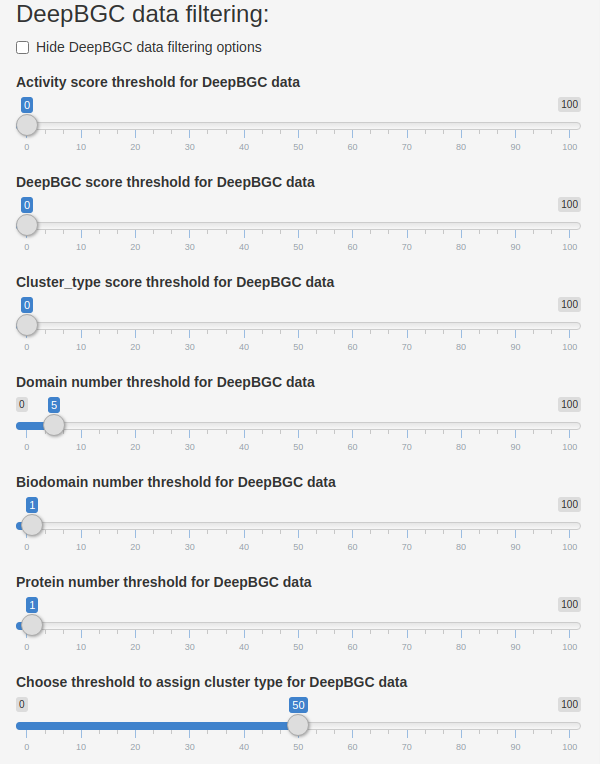

The filters are applied globally for DeepBGC data. For convenience you can use the filtering sliders on the sidebar, not the one under "Global options":


Therefore, BGCViz can be used not only as an interception between annotated BGC visualization tool but also serves as a nice GUI for DeepBGC data cleaning. The results on the cleaning can be then downloaded for downstream analysis (Step 7)

  

**Note: The tab and plots will appear after DeepBGC data upload. Therefore, if no Antismash, PRISM or SEMPI data was supplied the plots will result in error**

  
### The same workflow is available for GECCO data

# Step 7. Data download

  

After the analysis, you can download all the data as csv files (under Global options). This is particularly valuable in the case of DeepBGC data cleaning. Alongside the datasets, group_by table will be downloaded (as visualized in the "Summarize interception" tab) and group_by script for downstream analysis with clinker. More about it [here](https://ostash-group.github.io/BGCViz/#/Additional_analysis)

  

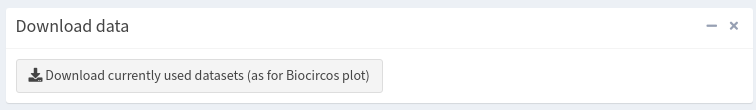


```{r}
sessionInfo()
```

